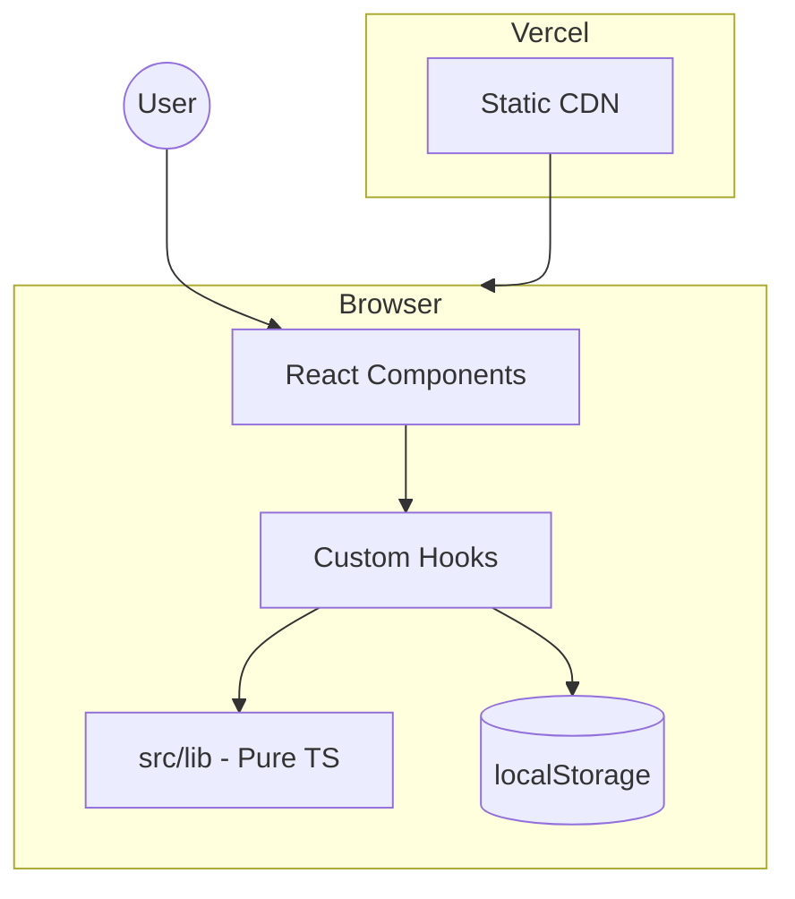

# atividade-aula-09 — Architecture Document

**Versão:** 1.0  
**Status:** Approved for implementation  
**Autor:** Aria (@architect)  
**Data:** 2026-05-27  
**Input:** [PRD](prd.md)

---

## 1. Introduction

Este documento define a arquitetura do **Gerador de Mensagens de Commit** — uma SPA estática que gera mensagens no padrão Conventional Commits, persiste histórico em `localStorage` e é implantada na Vercel.

Não há backend, banco de dados, autenticação nem APIs no MVP. Toda a lógica executa no browser.

### Starter Template

**Vite + React + TypeScript** (`npm create vite@latest`), com Tailwind CSS adicionado manualmente. Greenfield — sem código de aplicação existente além do scaffold AIOX.

### Change Log

| Date       | Version | Description                    | Author  |
|------------|---------|--------------------------------|---------|
| 2026-05-27 | 1.0     | Arquitetura inicial (SPA/Vercel) | Aria    |

---

## 2. High-Level Architecture

### 2.1 Technical Summary

Arquitetura **client-only Jamstack**: React 19 renderiza uma página única com formulário, preview reativa e lista de histórico. O domínio (formatação Conventional Commits, validação, persistência) vive em módulos TypeScript puros em `src/lib/`, testáveis com Vitest. Estado de UI via React hooks; histórico via adapter `localStorage`. Build Vite produz assets estáticos servidos pela Vercel CDN. GitHub Actions valida lint e testes antes do merge.

### 2.2 Architecture Diagram



### 2.3 Platform Choice

| Opção              | Prós                          | Contras                    |
|--------------------|-------------------------------|----------------------------|
| **Vercel (escolhida)** | Deploy zero-config, previews por PR, free tier | Só estático no MVP         |
| Netlify            | Similar à Vercel              | Sem requisito no PRD       |
| GitHub Pages       | Grátis                        | Sem preview branches ricas |

**Decisão:** **Vercel** — alinhado ao PRD (NFR5), integração nativa com GitHub `Cauams19/atividade-aula-09`.

**Serviços:** Vercel Hosting (static), GitHub (source), GitHub Actions (CI). Sem Supabase/Railway no MVP.

### 2.4 Repository Structure

**Monorepo flat** — aplicação na raiz do repositório (não `apps/web/`), pois o projeto é uma única SPA pequena.

```
atividade-aula-09/
├── .github/workflows/     # CI
├── docs/                  # PRD, architecture, stories
├── public/                # favicon, static assets
├── src/
│   ├── components/        # UI React
│   ├── hooks/             # useCommitForm, useHistory
│   ├── lib/               # domínio puro (sem React)
│   ├── types/             # tipos compartilhados
│   ├── App.tsx
│   └── main.tsx
├── index.html
├── package.json
├── vite.config.ts
├── tailwind.config.js
├── vercel.json
└── vitest.config.ts
```

---

## 3. Technology Stack

| Category        | Technology        | Version  | Purpose                          |
|-----------------|-------------------|----------|----------------------------------|
| Language        | TypeScript        | 5.x      | Type safety                      |
| Framework       | React             | 19.x     | UI components                    |
| Build           | Vite              | 6.x      | Dev server & production bundle   |
| Styling         | Tailwind CSS      | 4.x      | Responsive utility-first CSS     |
| Testing         | Vitest            | 3.x      | Unit tests                       |
| Testing UI      | Testing Library   | 16.x     | Component/integration tests      |
| Lint            | ESLint            | 9.x      | Code quality                     |
| Deploy          | Vercel            | —        | Static hosting                   |
| CI              | GitHub Actions    | —        | lint + test on PR                |

**Não utilizado no MVP:** Redux, React Router (single page), backend framework, ORM, Supabase.

Detalhes: [pilha-tecnologica.md](architecture/pilha-tecnologica.md)

---

## 4. Domain Layer (`src/lib/`)

Camada **sem dependência de React** — funções puras, fáceis de testar.

### 4.1 Types

```typescript
// src/types/commit.ts

export const COMMIT_TYPES = [
  'feat', 'fix', 'docs', 'style', 'refactor',
  'perf', 'test', 'build', 'ci', 'chore', 'revert',
] as const;

export type CommitType = (typeof COMMIT_TYPES)[number];

export interface CommitFormInput {
  type: CommitType;
  scope: string;       // trimmed; empty = no scope
  description: string;
}

export interface CommitMessageResult {
  message: string;
  warnings: string[];  // non-blocking convention hints
}

export interface HistoryEntry {
  id: string;          // crypto.randomUUID()
  createdAt: string;   // ISO 8601
  type: CommitType;
  scope: string;
  description: string;
  message: string;
}

export interface HistoryStore {
  version: 1;
  entries: HistoryEntry[];
}
```

### 4.2 `buildCommitMessage`

```typescript
// src/lib/buildCommitMessage.ts

/**
 * Formats a Conventional Commit message.
 * @throws never — returns warnings instead of throwing for soft rules
 */
export function buildCommitMessage(input: CommitFormInput): CommitMessageResult {
  const scope = input.scope.trim();
  const description = input.description.trim();
  const warnings: string[] = [];

  if (description.length > 0) {
    if (description[0] === description[0].toUpperCase() && description[0] !== description[0].toLowerCase()) {
      warnings.push('Descrição deve começar em minúsculas.');
    }
    if (description.endsWith('.')) {
      warnings.push('Descrição não deve terminar com ponto final.');
    }
  }

  const header = scope
    ? `${input.type}(${scope}): ${description}`
    : `${input.type}: ${description}`;

  return { message: header, warnings };
}
```

### 4.3 Validation

```typescript
// src/lib/validateCommitForm.ts

const SCOPE_REGEX = /^[a-z0-9-]*$/;  // empty allowed
const DESC_MIN = 3;
const DESC_MAX = 72;

export interface ValidationResult {
  valid: boolean;
  errors: Partial<Record<'type' | 'scope' | 'description', string>>;
}

export function validateCommitForm(input: CommitFormInput): ValidationResult {
  const errors: ValidationResult['errors'] = {};
  const scope = input.scope.trim();
  const description = input.description.trim();

  if (!COMMIT_TYPES.includes(input.type)) {
    errors.type = 'Tipo inválido.';
  }
  if (scope && !SCOPE_REGEX.test(scope)) {
    errors.scope = 'Escopo: apenas letras minúsculas, números e hífen.';
  }
  if (description.length < DESC_MIN) {
    errors.description = `Mínimo ${DESC_MIN} caracteres.`;
  } else if (description.length > DESC_MAX) {
    errors.description = `Máximo ${DESC_MAX} caracteres.`;
  }

  return { valid: Object.keys(errors).length === 0, errors };
}
```

### 4.4 History Storage

```typescript
// src/lib/historyStorage.ts

const STORAGE_KEY = 'commit-generator:history:v1';
const MAX_ENTRIES = 50;

export function loadHistory(): HistoryEntry[] { /* parse + validate schema */ }
export function appendHistory(entry: HistoryEntry): void { /* FIFO cap at 50 */ }
export function clearHistory(): void { /* remove key */ }
```

**Schema JSON em localStorage:**

```json
{
  "version": 1,
  "entries": [
    {
      "id": "550e8400-e29b-41d4-a716-446655440000",
      "createdAt": "2026-05-27T12:00:00.000Z",
      "type": "feat",
      "scope": "ui",
      "description": "add commit preview",
      "message": "feat(ui): add commit preview"
    }
  ]
}
```

**Resiliência:** `try/catch` em read/write; se `localStorage` indisponível (modo privado restrito), retornar `[]` e exibir banner informativo na UI.

---

## 5. Application Layer

### 5.1 Component Map

| Component           | Responsibility                                      |
|---------------------|-----------------------------------------------------|
| `App`               | Layout página única, compõe seções                  |
| `CommitForm`        | type select, scope, description, validation display |
| `CommitPreview`     | Mensagem monoespaçada + warnings                    |
| `CopyButton`        | Clipboard + `aria-live` feedback                    |
| `HistoryList`       | Lista ordenada, reuse, recopy                       |
| `HistoryItem`       | Card individual                                     |
| `ClearHistoryDialog`| Confirmação antes de limpar                         |
| `StorageBanner`     | Aviso se storage indisponível                       |

### 5.2 Hooks

| Hook              | Responsibility                                           |
|-------------------|----------------------------------------------------------|
| `useCommitForm`   | Estado do formulário, validação, preview derivado        |
| `useHistory`      | load/append/clear, sincroniza após cópia bem-sucedida    |
| `useClipboard`    | `navigator.clipboard.writeText` + fallback               |

### 5.3 Data Flow

1. Usuário edita formulário → `useCommitForm` chama `validateCommitForm` + `buildCommitMessage`.
2. Preview atualiza em tempo real (derivado, sem submit).
3. "Copiar" → se válido, `useClipboard.copy(message)` → `appendHistory` → refresh lista.
4. "Reutilizar" no histórico → preenche estado do formulário.

---

## 6. Cross-Cutting Concerns

### 6.1 Accessibility (WCAG 2.1 AA)

- `<label>` explícitos em todos os inputs.
- `aria-live="polite"` na região de feedback de cópia.
- Foco visível (`focus-visible:ring`).
- Contraste mínimo 4.5:1 (Tailwind palette validada).
- Dialog de limpar histórico com trap de foco.

### 6.2 Error Handling

| Cenário                    | Tratamento                                      |
|----------------------------|-------------------------------------------------|
| Formulário inválido        | Desabilitar copiar; erros inline                  |
| Clipboard negado           | Mensagem + fallback `execCommand`               |
| localStorage quota/full    | Toast; tentar trim histórico                    |
| JSON corrupto no storage   | Reset para `[]`, log console (dev)              |

### 6.3 Security

- Sem secrets no cliente.
- Sem `dangerouslySetInnerHTML` — texto escapado por React por padrão.
- Headers Vercel: `X-Content-Type-Options: nosniff` (config opcional em `vercel.json`).
- CSP básica opcional pós-MVP.

### 6.4 Performance

- Code-splitting não necessário (bundle pequeno).
- Fontes do sistema ou uma fonte Google com `preconnect`.
- Meta Lighthouse Performance ≥ 90 (Story 2.3).

---

## 7. Deployment

### 7.1 Vercel Configuration

```json
{
  "buildCommand": "npm run build",
  "outputDirectory": "dist",
  "framework": "vite",
  "installCommand": "npm ci"
}
```

### 7.2 Environments

| Environment | Branch   | URL                    |
|-------------|----------|------------------------|
| Production  | `main`   | `*.vercel.app` ou custom |
| Preview     | PR branches | Auto preview        |

Sem variáveis de ambiente obrigatórias no MVP.

---

## 8. CI/CD Pipeline

```yaml
# .github/workflows/ci.yml
name: CI
on:
  pull_request:
  push:
    branches: [main]
jobs:
  quality:
    runs-on: ubuntu-latest
    steps:
      - uses: actions/checkout@v4
      - uses: actions/setup-node@v4
        with:
          node-version: '22'
          cache: 'npm'
      - run: npm ci
      - run: npm run lint
      - run: npm run typecheck
      - run: npm test
      - run: npm run build
```

Vercel deploy automático via integração GitHub (produção em `main`).

---

## 9. Testing Strategy

| Layer        | Tool        | Target                                      |
|--------------|-------------|---------------------------------------------|
| Unit         | Vitest      | `buildCommitMessage`, `validateCommitForm`, `historyStorage` |
| Component    | RTL + Vitest| `CommitForm`, `CopyButton` (mock clipboard)   |
| E2E          | — (opcional)| Playwright pós-MVP                          |

**Cobertura mínima:** 80% em `src/lib/` antes de marcar Epic 1 completo.

---

## 10. Requirements Traceability

| PRD   | Architecture Element                          |
|-------|-----------------------------------------------|
| FR1–4 | `COMMIT_TYPES`, `buildCommitMessage`          |
| FR5   | `useClipboard`, `CopyButton`                    |
| FR6–8 | `historyStorage`, `HistoryList`, `ClearHistoryDialog` |
| FR9   | Vite static build, no runtime API               |
| FR10  | Derived preview in `useCommitForm`            |
| NFR1  | Vite + minimal deps                             |
| NFR3  | §6.1 Accessibility                            |
| NFR5  | §7 Deployment + §8 CI                         |
| NFR6  | `MAX_ENTRIES = 50` in `historyStorage`        |

---

## 11. Implementation Order (for @dev)

1. **Story 1.1** — `npm create vite@latest` + Tailwind + ESLint + Vitest + `vercel.json` + CI workflow.
2. **Story 1.2–1.3** — `src/lib/*` + `CommitForm` + `CommitPreview` + tests.
3. **Story 1.4** — `useClipboard` + `CopyButton`.
4. **Story 2.1–2.3** — `historyStorage` + `HistoryList` + polish.

---

## 12. Sharded Documents

| Document | Path |
|----------|------|
| Tech stack detail | [architecture/pilha-tecnologica.md](architecture/pilha-tecnologica.md) |
| Coding standards | [architecture/padroes-de-codigo.md](architecture/padroes-de-codigo.md) |
| Source tree | [architecture/arvore-de-origem.md](architecture/arvore-de-origem.md) |

---

## Next Steps

1. `@sm` → `*create-story` ou `*draft` para stories em `docs/stories/`
2. `@dev` → Epic 1, Story 1.1 (scaffold Vite)

---

*— Aria, arquitetando com visão 🏛️*
