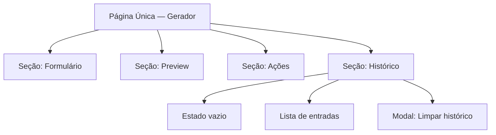
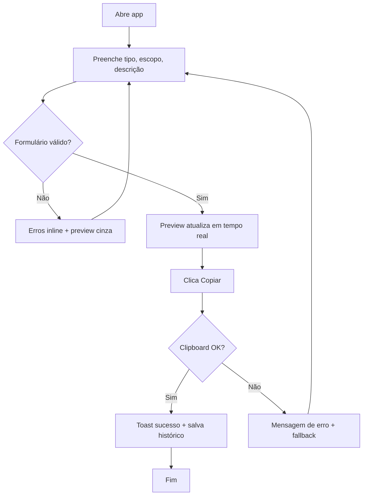
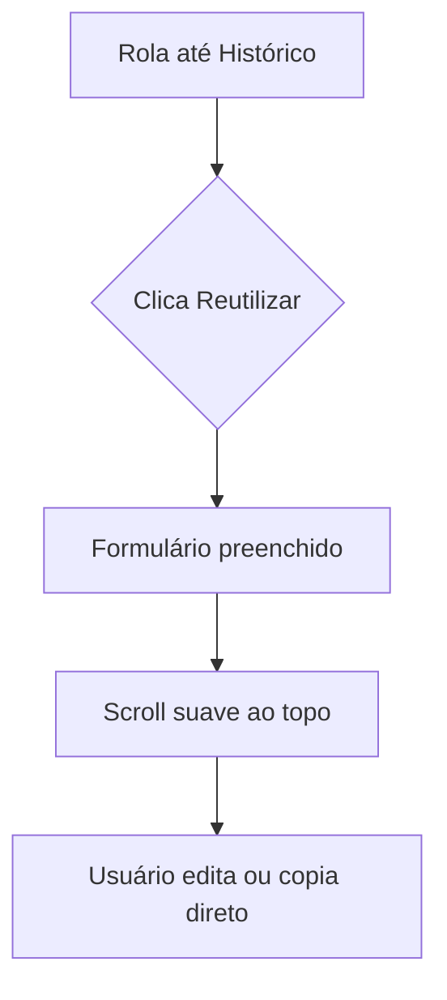
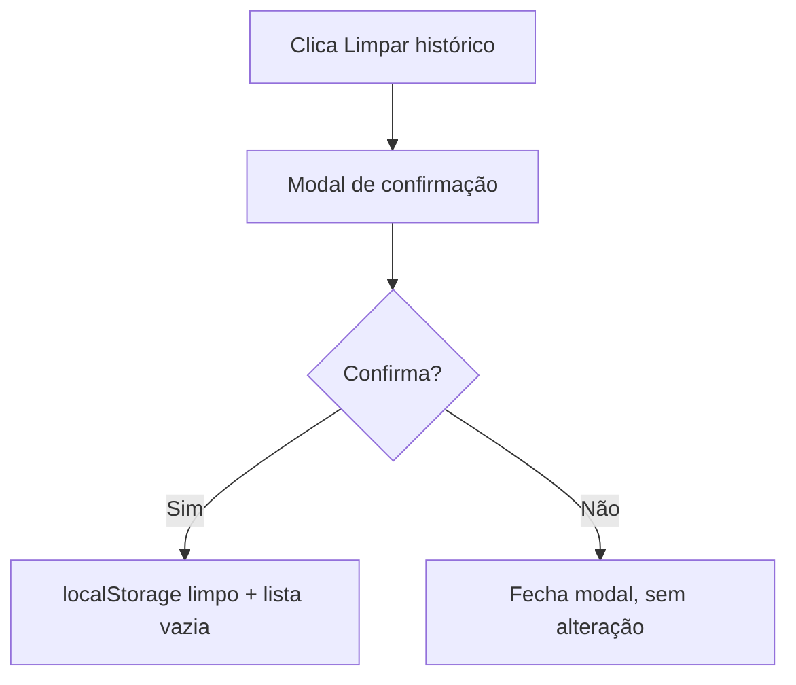

# atividade-aula-09 — UI/UX Specification

**Versão:** 1.0  
**Status:** Ready for development  
**Autor:** Uma (@ux-design-expert)  
**Data:** 2026-05-27  
**Inputs:** [PRD](prd.md) · [Architecture](architecture.md)

---

## 1. Introduction

Este documento define experiência, fluxos, wireframes e diretrizes visuais do **Gerador de Conventional Commits** — ferramenta web de página única para desenvolvedores gerarem, copiarem e reutilizarem mensagens de commit.

**Escopo:** MVP mobile-first, WCAG 2.1 AA, tema claro/escuro via preferência do sistema.

### Change Log

| Date       | Version | Description              | Author |
|------------|---------|--------------------------|--------|
| 2026-05-27 | 1.0     | Spec inicial + wireframes | Uma    |

---

## 2. Overall UX Goals & Principles

### Target User Personas

**Desenvolvedor Individual (primário)**  
Usa Git diariamente, conhece Conventional Commits superficialmente, quer velocidade e zero fricção. Copia a mensagem e cola no terminal ou GUI do Git. Valoriza preview correto e histórico local.

**Dev Júnior (secundário)**  
Ainda aprende padrões de commit. Precisa de labels claros, validação gentil e exemplos nos placeholders. Os avisos de convenção (minúscula, sem ponto) são educativos, não punitivos.

### Usability Goals

| Meta | Critério de sucesso |
|------|-------------------|
| Velocidade | Gerar e copiar em **&lt; 30 segundos** |
| Aprendizado | Primeiro uso sem documentação externa |
| Prevenção de erro | Copiar desabilitado se formulário inválido |
| Feedback imediato | Preview atualiza a cada keystroke |
| Controle de dados | Limpar histórico exige confirmação explícita |

### Design Principles

1. **Clareza sobre decoração** — UI tipo “dev tool”, não marketing.
2. **Uma tela, um trabalho** — gerar commit; histórico é secundário (abaixo).
3. **Feedback imediato** — preview, validação e cópia sempre visíveis.
4. **Acessível por padrão** — não é feature opcional.
5. **Respeitar convenções** — a UI ensina Conventional Commits pelo comportamento.

---

## 3. Information Architecture

### Site Map



**Navegação:** Nenhuma rota interna no MVP. Scroll vertical único. Âncora opcional “Ir para histórico” no header.

### Navigation Structure

| Tipo | Comportamento |
|------|---------------|
| Primary | Inexistente (single page) |
| Secondary | Link âncora `#historico` após primeira geração |
| Breadcrumb | N/A |

---

## 4. User Flows

### Flow 1: Gerar e copiar mensagem

**User Goal:** Obter mensagem Conventional Commit válida no clipboard.

**Entry Points:** Landing (única URL).

**Success Criteria:** Mensagem copiada; toast/aria confirma sucesso.



**Edge Cases:**
- Descrição vazia → botão Copiar desabilitado.
- Escopo com caracteres inválidos → erro no campo escopo.
- Clipboard bloqueado → instrução “Selecione e copie manualmente” + preview selecionável.

---

### Flow 2: Reutilizar do histórico

**User Goal:** Preencher formulário com commit anterior.



**Edge Cases:** Histórico vazio → ilustração + texto “Nenhum commit gerado ainda”.

---

### Flow 3: Limpar histórico



---

## 5. Wireframes & Mockups

**Design Files:** Wireframes low-fi neste documento. Figma opcional pós-MVP.

### Screen: Home — Gerador (mobile, 375px)

```
┌─────────────────────────────────────┐
│  ◆ CommitGen          [Histórico ↓] │  ← header sticky
├─────────────────────────────────────┤
│  Nova mensagem                      │
│                                     │
│  Tipo *                             │
│  ┌─────────────────────────────┐   │
│  │ feat                      ▼ │   │
│  └─────────────────────────────┘   │
│                                     │
│  Escopo (opcional)                  │
│  ┌─────────────────────────────┐   │
│  │ ex: auth, ui, api           │   │
│  └─────────────────────────────┘   │
│                                     │
│  Descrição *                        │
│  ┌─────────────────────────────┐   │
│  │ add login form validation   │   │
│  └─────────────────────────────┘   │
│  ⚠ Descrição deve começar em...    │  ← warning (non-blocking)
│                                     │
│  Preview                            │
│  ┌─────────────────────────────┐   │
│  │ feat(auth): add login form  │   │  ← mono, bg elevated
│  │         validation          │   │
│  └─────────────────────────────┘   │
│                                     │
│  ┌─────────────────────────────┐   │
│  │      📋 Copiar mensagem      │   │  ← primary CTA full-width
│  └─────────────────────────────┘   │
│                                     │
├─────────────────────────────────────┤
│  Histórico              [Limpar]    │
│  ┌─────────────────────────────┐   │
│  │ feat(ui): fix button align  │   │
│  │ há 2 min    [Copiar][Reuse] │   │
│  └─────────────────────────────┘   │
│  ┌─────────────────────────────┐   │
│  │ fix: resolve npm audit      │   │
│  │ ontem       [Copiar][Reuse] │   │
│  └─────────────────────────────┘   │
└─────────────────────────────────────┘
```

**Interaction Notes:**
- Preview usa `font-mono`; fundo `bg-slate-100` / `dark:bg-slate-800`.
- CTA primário fixo opcional no mobile (sticky bottom) — testar em implementação; preferir inline se não atrapalhar scroll.
- Select de tipo agrupado visualmente (Changes vs Maintenance) — opcional nice-to-have.

### Screen: Home — Desktop (≥1024px)

```
┌──────────────────────────────────────────────────────────────┐
│  ◆ CommitGen                              [Ir para histórico] │
├────────────────────────────┬─────────────────────────────────┤
│  FORM (50%)                │  PREVIEW + CTA (50%)              │
│  Tipo, Escopo, Descrição   │  Preview grande                   │
│  Erros inline              │  [ Copiar mensagem ]              │
│                            │  Warnings list                    │
├────────────────────────────┴─────────────────────────────────┤
│  Histórico (full width, grid 2 colunas de cards)              │
└──────────────────────────────────────────────────────────────┘
```

### Modal: Limpar histórico

```
┌─────────────────────────────────┐
│  Limpar histórico?          [×] │
│                                 │
│  Esta ação remove todas as      │
│  mensagens salvas neste         │
│  navegador. Não pode desfazer.│
│                                 │
│     [Cancelar]  [Limpar tudo]   │
│                  ↑ destructive  │
└─────────────────────────────────┘
```

---

## 6. Component Library

**Approach:** Componentes Tailwind customizados (sem shadcn obrigatório no MVP). Tokens abaixo mapeiam para classes.

### Button

| Variant | Uso |
|---------|-----|
| `primary` | Copiar mensagem |
| `secondary` | Reutilizar, Copiar no card |
| `ghost` | Limpar histórico (header da seção) |
| `destructive` | Confirmar limpar no modal |

**States:** default, hover, focus-visible, disabled (opacity 50%), loading (spinner no Copiar).

### Select / Input

- Height mínima 44px (touch target).
- Border `neutral-300`; focus ring `primary-500`.
- Error: border `error-500` + texto abaixo com `role="alert"`.

### CommitPreview

- `aria-label="Preview da mensagem de commit"`.
- Texto selecionável (`user-select: all`).

### HistoryCard

- Mensagem truncada 1 linha no mobile, 2 no desktop.
- Timestamp relativo (“há 2 min”, “ontem”).

### Toast / LiveRegion

- `aria-live="polite"` para “Copiado!” / erros.

---

## 7. Branding & Style Guide

### Visual Identity

Estética **developer tool**: limpa, confiável, sem ilustrações pesadas. Ícone ◆ ou emoji 📋 apenas no CTA.

### Color Palette

| Color Type | Light Mode | Dark Mode | Usage |
|------------|------------|-----------|-------|
| Primary | `#2563EB` | `#3B82F6` | CTA, focus ring |
| Surface | `#FFFFFF` | `#0F172A` | Background |
| Elevated | `#F1F5F9` | `#1E293B` | Preview box, cards |
| Text | `#0F172A` | `#F8FAFC` | Body |
| Text muted | `#64748B` | `#94A3B8` | Hints, timestamps |
| Success | `#16A34A` | `#22C55E` | Copiado |
| Warning | `#D97706` | `#FBBF24` | Convention hints |
| Error | `#DC2626` | `#EF4444` | Validation errors |
| Border | `#E2E8F0` | `#334155` | Inputs, cards |

Contraste mínimo **4.5:1** texto normal; **3:1** texto grande.

### Typography

| Element | Size | Weight | Font |
|---------|------|--------|------|
| H1 (app title) | 1.5rem | 600 | Inter / system-ui |
| H2 (section) | 1.125rem | 600 | Inter |
| Body | 1rem | 400 | Inter |
| Small / hint | 0.875rem | 400 | Inter |
| Preview | 1rem | 500 | **JetBrains Mono**, ui-monospace |

### Iconography

**Lucide React** (ou Heroicons) — ícones 20px inline: Copy, RotateCcw (reuse), Trash2, AlertTriangle.

### Spacing & Layout

**Scale (Tailwind):** 4, 8, 12, 16, 24, 32, 48 px.

| Breakpoint | Min Width | Layout |
|------------|-----------|--------|
| Mobile | 0 | Stack vertical, padding 16px |
| Tablet | 640px | Stack, padding 24px |
| Desktop | 1024px | 2 colunas form + preview |
| Wide | 1280px | max-width 960px centered |

---

## 8. Accessibility Requirements

**Standard:** WCAG 2.1 Level AA

### Key Requirements

**Visual**
- Contraste conforme tabela §7.
- Focus ring 2px offset visível em todos os interativos.
- Texto base mínimo 16px no mobile.

**Interaction**
- Tab order: tipo → escopo → descrição → copiar → histórico (top-down).
- Modal: focus trap, Esc fecha, retorna foco ao trigger.
- Touch targets ≥ 44×44px.

**Content**
- `<label>` em todos os campos; `aria-describedby` para erros/avisos.
- Preview anunciada via `aria-live="polite"` apenas no copiar (evitar spam a cada keystroke).
- Botão destrutivo com texto explícito “Limpar tudo”, não só ícone.

### Testing Strategy

- axe DevTools no build de produção.
- Navegação completa só com teclado.
- VoiceOver/NVDA: fluxo copiar + histórico.

---

## 9. Responsiveness Strategy

| Breakpoint | Adaptation |
|------------|------------|
| Mobile | Stack; histórico em cards full-width |
| Tablet | Mesmo stack, mais whitespace |
| Desktop | Split 50/50 form/preview; histórico 2 colunas |

**Content Priority:** Preview + CTA sempre acima da dobra no mobile (form primeiro, preview logo abaixo — não esconder CTA).

---

## 10. Animation & Micro-interactions

### Motion Principles

- Sutil, &lt; 200ms, respeitar `prefers-reduced-motion`.
- Sem animações decorativas no preview.

| Animation | Description | Duration |
|-----------|-------------|----------|
| Copy success | Scale 1 → 1.02 → 1 no botão | 150ms |
| Toast enter | fade + slide up | 200ms |
| Modal | fade overlay + scale in | 200ms |
| Reuse scroll | `scrollIntoView({ behavior: 'smooth' })` | 300ms |

---

## 11. Performance Considerations

| Goal | Target |
|------|--------|
| LCP | &lt; 2.5s |
| Input → preview | &lt; 16ms (síncrono) |
| Animation | 60fps |

**Design Strategies:** System fonts fallback; sem imagens hero; SVG favicon apenas.

---

## 12. Design Tokens (Tailwind mapping)

```js
// tailwind.config — extend theme
colors: {
  primary: { DEFAULT: '#2563EB', dark: '#3B82F6' },
  surface: { DEFAULT: '#FFFFFF', dark: '#0F172A' },
  elevated: { DEFAULT: '#F1F5F9', dark: '#1E293B' },
},
fontFamily: {
  sans: ['Inter', 'system-ui', 'sans-serif'],
  mono: ['JetBrains Mono', 'ui-monospace', 'monospace'],
},
```

---

## 13. Handoff Checklist

- [x] User flows documented
- [x] Component inventory defined
- [x] Accessibility requirements defined
- [x] Responsive strategy clear
- [x] Color & typography specified
- [x] Performance goals established
- [ ] Figma high-fi (optional)

---

## 14. Next Steps

1. `@sm` — stories alinhadas a este spec  
2. `@dev` — implementar UI conforme wireframes §5 e tokens §12  
3. Revisão visual após Epic 1 deploy preview na Vercel  

---

*— Uma, desenhando com empatia 🎨*
